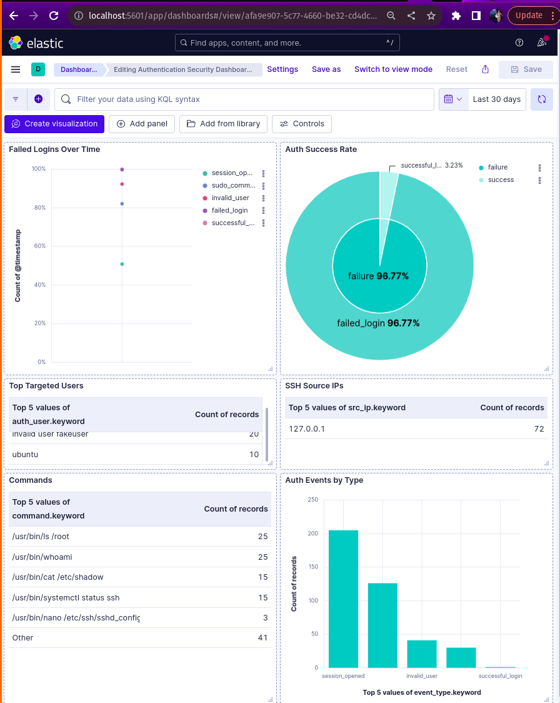
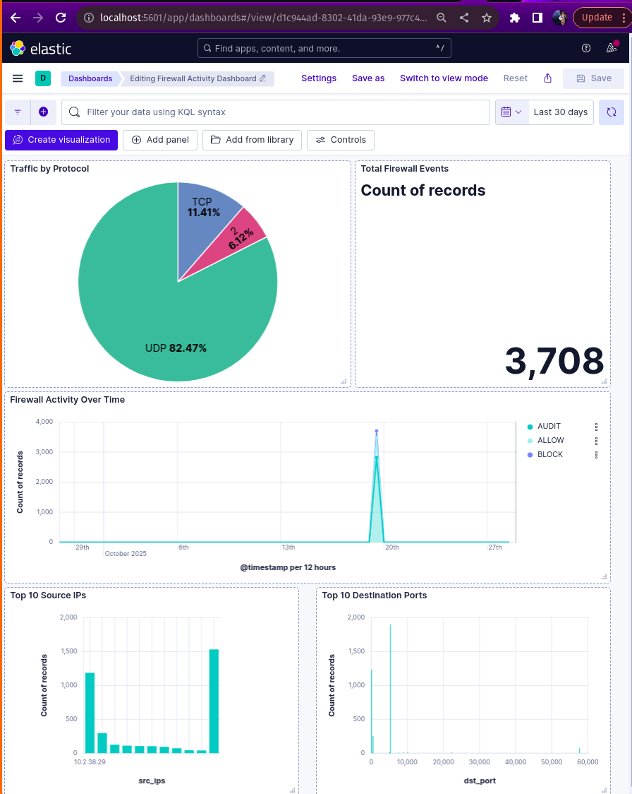
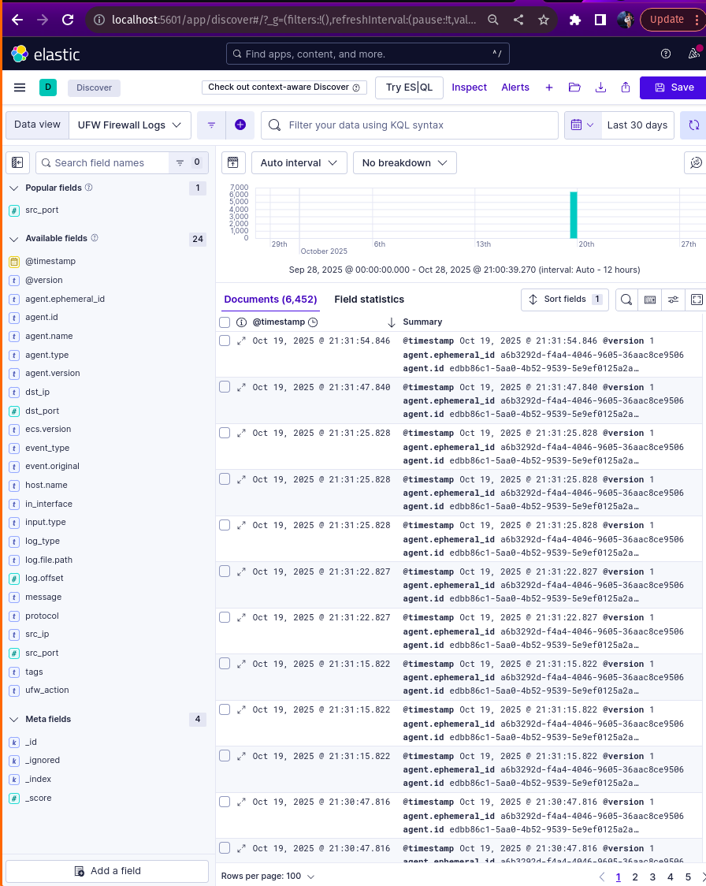

# Assignment 2: Advanced Analysis and Automation

## Overview of Assignment 2

Assignment 2 builds on Assignment 1 by adding:

1. Realistic security event generation (simulated attacks)
2. Anomaly detection (baseline vs attack patterns)
3. Automated alerting (real-time notifications)
4. Performance optimization (tuning ELK stack)

## Task 3.1

### Initial baseline logs.

Generating attack logs for the attack spike logs

### Spike in logs

### Dashboards after attack Spike 

Baseline log count: 

Total UFW logs:6452               
Total Auth logs:761         

Attack spike log count:

Total UFW logs: 6964
Total Auth logs: 1798

## Task 3.2: Alerting and Correlation

For your understanding:

Think of it like this:

Right now: we have to manually check Kibana to see if attacks are happening
After Task 3.2: The system will automatically alert us when attacks happen!

It's like having a security guard who shouts at us when something bad happens, instead of us having to watch cameras 24/7!

### what we need to do 

We need to set up 4 automatic alerts that will notify us when:

- Someone tries to brute force SSH (5+ failed logins in 5 minutes)

- A new unknown IP tries to connect (IP never seen before)

- Someone uses suspicious sudo commands (accessing /etc/shadow, passwd, etc.)

we also need 3 correlation rules that connect events together.

### Tool We'll Use: ElastAlert2

ElastAlert2 is like a robot that:

1. Watches Elasticsearch constantly
2. When it sees something suspicious (based on rules YOU write)
3. It sends you an alert (email, Slack, or just logs it)

### Install ElastAlert2

### Configure ElastAlert2

### Create Rules Directory

### Create Alert Rules

#### Alert Rule 1: Brute Force Detection

#### Alert Rule 2: New IP Detected

#### Alert Rule 3: Suspicious Sudo Commands

#### Alert Rule 4: Port Scanning Detection

### Create ElastAlert2 Index

### Run Elastalert

### Generate Test Events on Ubuntu VM

